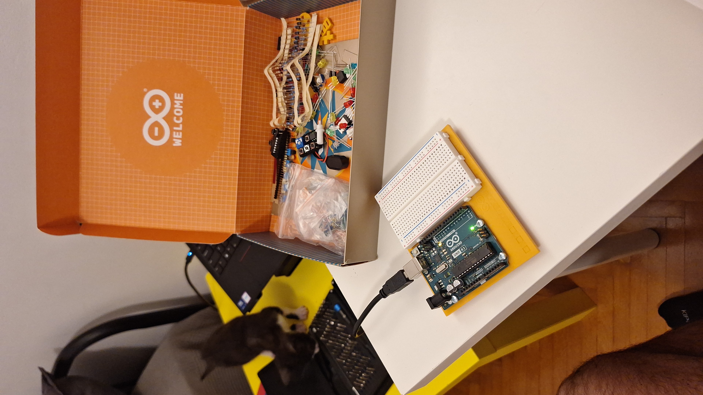

Working through the 15 projects proposed by the Arduino Starter Kit projects book.

I took this challenge in order to learn more about electronics, microcontrollers and circuits.

The full list of projects done on the arduino can be found on my [GitHub](https://github.com/anghelmarian/arduino-projects).